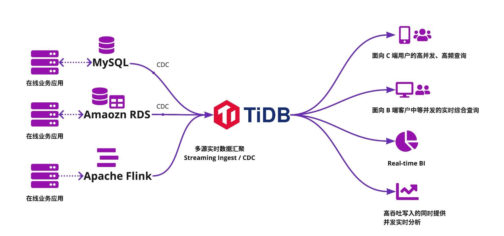
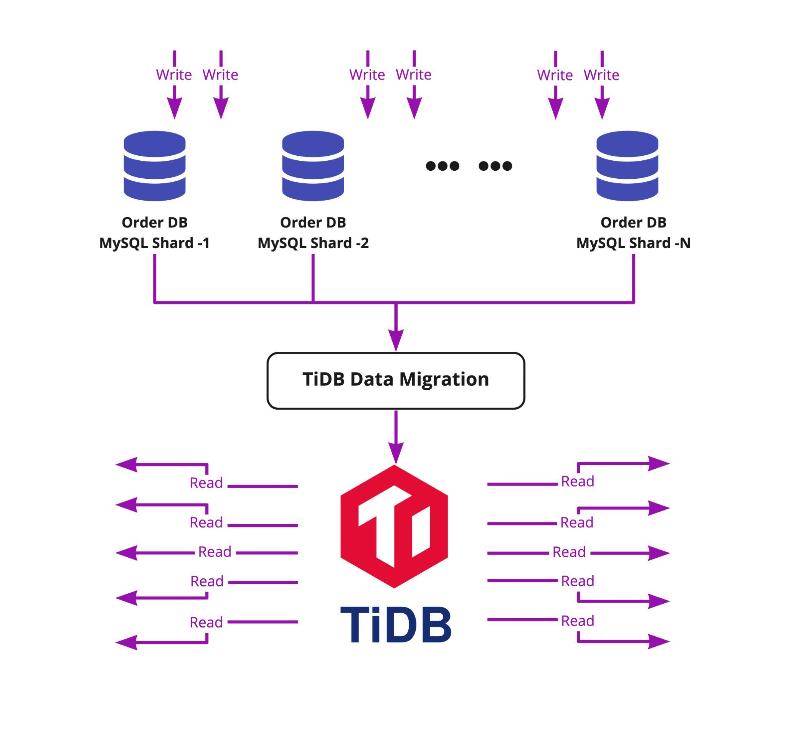

作为数字化新时代的企业级数据库， TiDB 基于海量数据规模的在线事务处理和实时分析能力在全球金融、互联网、物流、零售、在线游戏等各个行业得到充分验证，并广受好评。今年 4 月 ，TiDB 发布针对企业级的里程碑 5.0 版本，并在 6 月份发布了 5.1 版本，目前已经应用在数十家大型企业的生产环境。 

TiDB 5.2.0 聚焦于用户真实场景，挑战更为严苛的超大规模 OLTP 和实时数据分析的性能极限，进一步拓展了“交易+分析”双引擎数据处理能力的边界。测试结果表明，无论是高负载大集群场景还是高吞吐写入的并发实时分析场景，TiDB 5.2.0 均表现出了更优异的稳定性、更出色的实时性、更佳的易用性，可以更轻松地加速企业实现数字化转型和价值变现。

## TiDB 5.2 功能亮点和用户价值

近年来，为满足不同场景的业务需求，企业内部往往存在不同的数据存储方案，造成在线和离线业务数据分离，全量数据实时查询和分析成为难题。

在这种情况下，企业可以将数据实时汇聚到可无限水平扩展并兼容 MySQL 的 TiDB，由 TiDB 直接对接数据应用端。数据汇聚到 TiDB 后，无论是处理面向 C 端或 B 端客户的 OLTP 请求（例如，电商平台的 C 端和 B 端请求分别来自买家和卖家，物流平台的 C 端和 B 端请求分别来自寄件人和快递员），还是处理企业后台实时数据服务（例如，Real-time BI、风控、Ad-Hoc 查询），TiDB 都可以提供一站式的数据解决方案，帮助企业打通数据孤岛，既能保证高负载下大集群的查询稳定性和实时性，又能保证高吞吐写入下的并发实时查询和分析的性能与稳定性，并降低企业运维成本。

TiDB 5.2.0 针对多源实时数据汇聚四大典型场景中的主要挑战和特点做了大量优化，为不同场景量身打造更好用、更省心的数据库。

- 在面向 C 端用户的高并发、高频查询场景中，全面提升高负载下大集群的稳定性
	提升大表在高负载写入时在线建索引的速度，优化大流量写入时的内存使用，提升高读写负载压力下大集群的稳定性。
	实现 Leader 自动转移，降低单节点性能抖动对整个集群的影响。
	升级热点调度策略，有效打散小表热点，并且提供列存引擎 TiFlash 的热点调度能力，实现集群资源的充分利用。
	在 200K QPS 压力负载下，DM（TiDB Data Migration）仍可以保证 99% 时间的数据同步延迟在 1s 以内，提高汇聚库的数据更新实时性。

- 在面向 B 端客户中等并发的实时综合查询场景中，使优化器执行计划更智能
	当数据不断更新时，针对统计信息过期或缺失的情况，提升优化器选中正确索引的概率；提升估算模块的准确度，减少人工绑定索引。
	当使用 SPM（SQL Plan Management, 执行计划管理）功能自动或人工绑定索引时，用户可以更容易地使用、诊断、调试 SPM 功能。

- 在实时 BI 场景中，让企业轻松应对复杂实时 BI 查询，让业务决策更实时
	实现更多的 SQL 内建函数，与外部的 BI 分析工具集成的更好。
	实现更多的算子下推，能更充分地利用 MPP 引擎的能力，降低查询的响应时间。

- 在高吞吐写入的同时提供并发实时分析的场景中，提升并发实时分析性能和稳定性，助力企业从容应对双十一
	平稳支持超平时 200%～300% 的峰值写入流量，提供更强大的数据写入支持。
	消除了在特殊条件下内部线程互相等待死锁的状况，带来更智能的 MPP 执行引擎，提高分析处理能力。
	提升并发能力，可支持30量级的并发查询（全表扫描型）稳定执行。

## 提升高负载下大集群的稳定性，挑战 OLTP 巅峰

面向 C 端用户的高并发、高频查询以点查为主，也有部分基于索引的小范围查询，需要底层数据库具有非常好的弹性扩展能力、极低的查询延迟、极高的业务查询的稳定性。例如，在交易所的账户和订单等核心场景，业务对延迟极为敏感（订单写入需要控制在 1ms 以内），同时需要提供对客户端的高并发历史订单查询，在高峰期可能会对主流程造成影响。在此场景下，可以采取主从架构，突破 MySQL 单机瓶颈限制，通过数据迁移工具 DM 将前端多个 MySQL 分片的数据实时汇聚到一个 TiDB 集群，由 TiDB 承载核心链路上的高频查询，避免高峰期对前端订单写入造成压力，从而影响交易业务。

针对这些高负载低延迟的场景，TiDB 5.2.0 进一步提升了大规模 OLTP 性能和稳定性，为用户带来更流畅的业务体验：
- 提升高读写负载压力下大集群的稳定性
	提升大表在线建索引的速度：在 DDL 过程中合理均衡热点 Region 的 range。
	实现 Leader 自动转移：当某个存储节点变慢时，将 Raft 协议中的 leader 角色自动转移到正常的存储节点上以承载业务流量，保证单节点出现性能抖动时集群整体吞吐能力不受影响。
	优化 TiKV 的内存使用：严格限制 Raft Log 的 cache 以及 Raft 消息的内存占用，解决了在大流量写入情况下 TiKV 潜在的 OOM 问题。
- 热点调度引入 QPS 参考维度，实现集群资源的充分利用
	支持按维度调整热点均衡优先级，提高了对热点场景的处理能力，确保在节点数较多的集群中均衡 CPU 的使用率，避免出现单点瓶颈。在热点小表客户仿真场景中，CPU 资源的均衡度大幅提升，QPS 提升了近一倍。另外也支持对 OLAP 引擎 TiFlash 的热点调度能力，解决了 HTAP 场景的热点调度问题。
- 提升高负载下 DM 数据同步的性能和稳定性，提高汇聚库的数据更新实时性
	减少 DM 资源消耗：DM 2.0.6 以前版本对 CPU 资源消费较多。单 DM 节点的复制流量 1k ~ 3k QPS 下，运行在 32 vcore 机型的 3 个 DM 节点消耗 35% ～ 50% 的 CPU 资源。为了减少资源的消耗，v2.0.6 版本对多个逻辑点进行了优化，包括 relay log 读写、数据转码优化等。测试结果表明，DM v2.0.6 最多可减少 50% 的 CPU 使用量。
	大流量低延迟实时复制：使用 DM 同步 MySQL Shard 上的高负载（聚合后 200K QPS）业务写入数据到 TiDB，DM 可以保持 99% 时间内 1s 实时数据同步延迟。

## 优化器执行计划更智能，助力电商平台大促卖家订单处理

面向 B 端客户中等并发的综合查询通常基于索引查找小范围的数据，查询语句多样化，表关联可能会比较多，会遇到聚合、子查询、Top N 排序以及翻页 Limit。大小商户的数据量差异可能会非常大，通常有数据倾斜。电商平台通常采用读写分离的数据库架构，借助 TiDB 数据迁移工具 DM 将上游分库分表的订单实时汇聚到一个 TiDB 集群，提供实时的数据存取和查询服务。在电商大促销期间，面对比平时高几倍甚至几十倍的查询流量，如何在平台数据不断更新的情况下提高查询性能是对数据库的一大挑战。

TiDB 5.2.0 版本提供了一个更智能的查询优化器，使数据库能高效选中包含正确索引的最优的执行计划，更快速稳定地给出查询结果，为企业带来更实时的数据查询体验：
- 当优化器生成执行计划所需的统计信息过期或缺失时，TiDB 优化器会先使用启发式规则的方法来对索引进行裁剪和优化，提升选中正确索引的概率。
- 对优化器的估算模块进行了优化，使更多的查询可由优化器来自动选择正确索引计划，减少人工绑定索引。
- 当使用 SPM（SQL Plan Management, 执行计划管理）功能自动或人工绑定索引时，用户可以更容易地使用、诊断、调试 SPM 功能：
	绑定的查询语句会按照绑定时间戳排序显示，不再是无序显示的结果，方便定位绑定的语句。
	支持通过 `EXPLAIN` 语句执行的附加信息获知该 SQL 语句是否使用了绑定。
	支持通过设置黑名单定义自动捕获绑定的语句，为用户带来更大的使用灵活性。

## 轻松应对复杂实时 BI 查询，让业务决策更实时

实时 BI 提供商业智能系统中的数据实时动态刷新，具有数据量大、查询复杂、高并发性等特点，同时对查询的实时性有较高要求。例如，在金融领域，大量的交易数据需要给业务或风控部门提供自助分析，帮助用户及时调整金融方案。这些数据同时包含历史数据和实时数据，动辄几千万行，较为复杂的查询则会关联多个这样的数据表，且包含复杂度量（例如精确去重）的计算。

TiDB 的 HTAP 功能是这类需求的理想解决方案，一方面 TiDB 提供了高速的数据写入能力，实时数据可以高并发地写入至 TiKV 中，并利用 Raft 协议快速准确地将数据同步至 TiFlash 的列存中，实现了数据的实时性；另一方面，TiFlash 支持 MPP 模式的查询执行，最大限度地利用了计算资源，实现了数据查询的实时性。TiFlash 支持的函数或算子越多， TiDB 可以下推至 TiFlash 节点进行计算的 SQL 语句就越多，查询性能就越高。值得注意的是，只要某条 SQL 语句中存在一个尚不支持下推到 TiFlash 的算子或函数，该 SQL 语句的整个执行计划都无法下推至 TiFlash 节点，从而无法享受查询性能的提升。因此，多支持一个函数或算子就意味着某些特定查询数量级的性能飞跃。

为了给复杂 BI 场景带来更高的实时性，TiDB 5.2.0 新增了几十个下推函数和算子（如 MOD, LENGTH, LOG, ROUND, DATE, INET_ATON 等)，进一步完善了 TiFlash 的 SQL 语法支持。实际测试发现，TiFlash 在新支持某个函数后：
- 单并发场景下，简单查询的查询延迟由数十秒降低至不到一秒，复杂查询则是由数分钟降低至一秒左右。
- 数十并发场景下，简单查询依然可以以不到一秒的延迟响应查询，复杂查询则是从查询超时降低至 10 秒左右。

我们计划在未来一年内持续支持剩余的 MySQL 函数和算子，持续提升 BI 实时分析的查询响应时间。

## 提升高吞吐写入下的并发实时分析性能和稳定性，助力物流平台备战双十一

随着互联网时代的到来，提供海量数据实时分析服务的场景日益增多。以国内某头部物流公司的双十一场景为例，该公司一个基于宽表的典型 BI 查询应用，数据总量达百亿级别、日均更新达过亿级别、BI 实效性控制在分钟级、且有较高并发要求。TiDB 通过无限水平扩展的存储和实时 HTAP 的特性，较好地满足了该公司的需求。但随着双十一数据更新和分析任务的同时激增，业务对 TiFlash 的稳定性提出了更高的要求：如何避免节点磁盘内存使用不均衡引发内存 OOM、 如何缓解 IO 等系统资源压力、如何解决在大流量数据写入时产生的热点问题。

为了更好地满足前端海量数据写入+后端实时报表的需求，TiDB 5.2.0 提供以下功能助力企业更轻松地应对大数据量与高并发带来的压力。
- 更强大的数据写入支持：同规模的集群可以平稳承受 200%～300% 于以往的峰值写入流量，实现“写平衡”，各节点磁盘空间差异在 10% 以内。
- 更智能的 MPP 执行引擎：消除了在特殊条件下内部线程互相等待死锁的状况，进一步改善在高负载情况下查询出错或超时取消的问题。
- 更高的并发支持：10～20 条并发全表扫描的业务查询不出现内存 OOM。在更高的写入流量和并发查询下，出现 OOM 现象可减少 90%以上。
- 更简单的运维：即使偶发集群不稳定状态（例如节点重启），系统可以自动恢复，或在人工干预下很快恢复。在扩缩容集群时，对客户端的查询响应不会停止，极大地降低了维护 TiFlash 集群时对业务的影响。

## 结语

TiDB 针对极限 OLTP 和 OLAP 场景的产品能力打造和持续优化提升，具有非常大的挑战。5.2.0 版本只是一个开端，我们将在后面 1～2 个版本按照用户用户反馈持续优化快速迭代，把复杂交给 TiDB，把简单留给用户，打造更加适合用户场景的数据库。

最后，特别感谢 TiDB 社区每一位开发者的贡献，特别感谢理想汽车、腾讯互娱、小米等公司为 5.2.0 版本的产品改进提供的宝贵建议。相信在大家的共同努力和开放透明的协作下，TiDB 会越来越好，为用户创造更多价值，助力用户更好地拥抱数字化时代。

查看 TiDB 5.2.0 Release Notes，立即下载试用，开启 TiDB 5.2.0 之旅。
